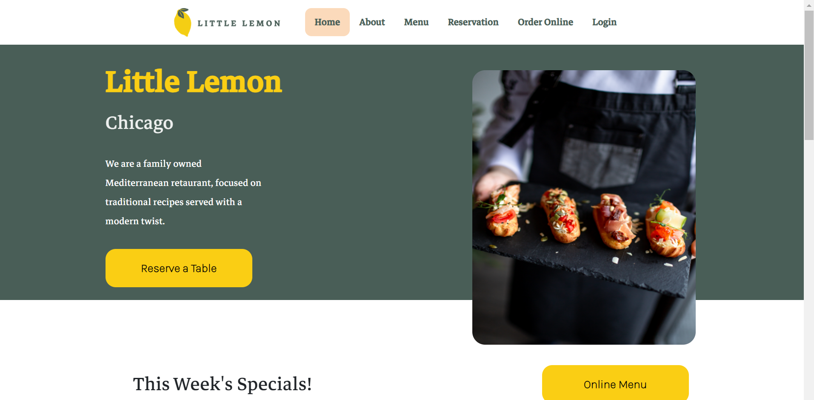
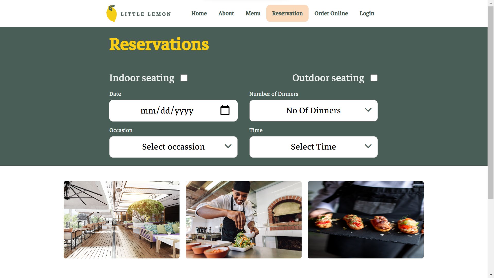
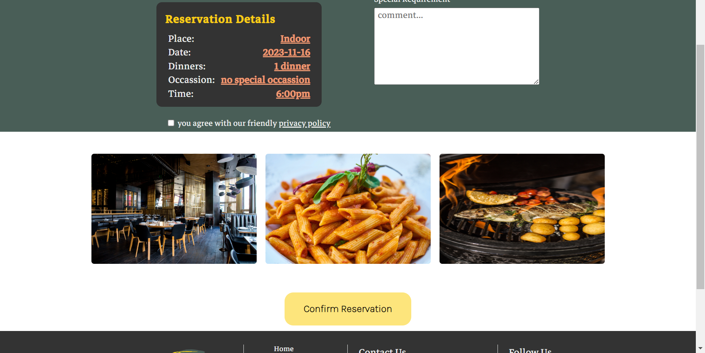

# Little Lemon Reservation

This project is the Front-End Developer Capstone Project completed as part of the Coursera Front-End Web Development Specialization.

## Table of Contents

- [Introduction](#introduction)
- [Features](#features)
- [Screenshots](#screenshots)
- [Technologies Used](#technologies-used)
- [Check The Project](#check)

## Introduction

The Little Lemon Online Reservation System is a web application that allows users to reserve a table at a restaurant. It provides a user-friendly interface for selecting the place, date, number of dinners, occasion, and time for the reservation.

## Features

- **Place Selection:** Users can choose between indoor and outdoor seating.
- **Date and Time Selection:** Users can select the date and time for their reservation.
- **Number of Dinners:** Users can choose the number of dinners they want to reserve.
- **Occasion Selection:** Users can specify the occasion for their reservation.
- **Privacy Agreement:** Users must agree to the privacy policy before confirming the reservation.
- **Confirmation Page:** After submitting the reservation, users see a confirmation page with the details.

## Screenshots
<b>Screenshot 1</b>

<b>Screenshot 2</b>

<b>Screenshot 3</b>

## Technologies Used

- React
- HTML/CSS
- JavaScript
- [React Router](https://reactrouter.com/)
- [Figma](https://www.figma.com/file/kTJehU31mZQFDpsnQQel0a/little-lemon?type=design&node-id=0%3A1&mode=design&t=h5j0r9oFqH4mbe6y-1)

## Check
<b>**you can check the project</b>    <b>[Here](http://zekua.me/little-lemon/).</b>

